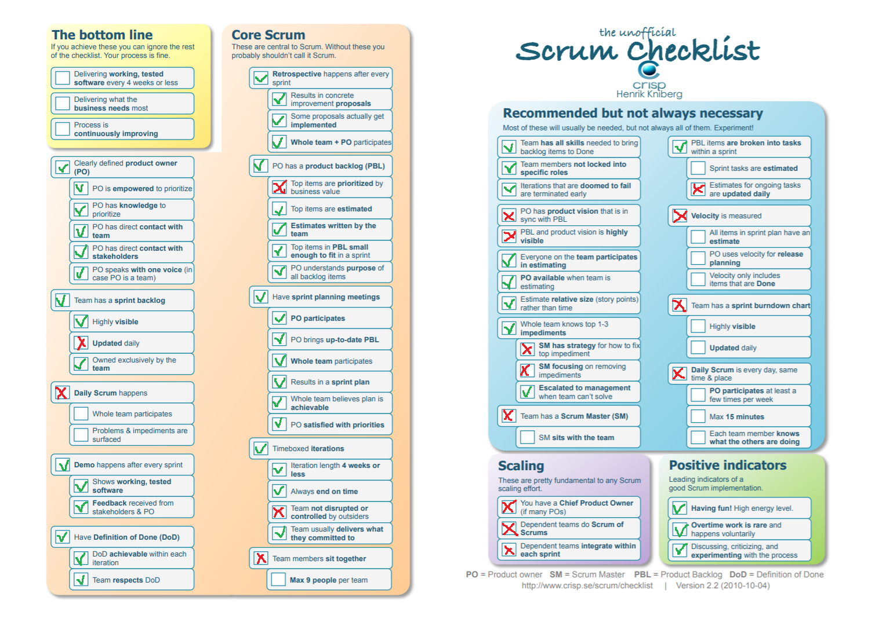

### Justifications for items not picked:
**Daily Scrum happens** - We have other courses so can’t work on the project every day.  
**Team not disrupted or controlled by outsiders** - Outsiders being other courses.  
**Team members sit together** - Corona.  
**Team has a Scrum Master (SM)** - Team is small enough that it’s not needed to have a designated Scrum Master.  
**Team has a sprint burndown chart** - It’s an extra thing to do that’s not necessary.  
**Scaling** - We have one small team so scaling is not an issue.  
**Velocity is measured** - Another extra thing we can do without. It’s a small project and we are somewhat restricted  in our release planning anyway.  
**PBL top items are prioritized by business value** - As from the grading standpoint the value should be similar for all items then the priority of the items would also be similar.  
**PO has product vision that is in sync with PBL** - Between the project description and PBL, writing the product vision down would be a waste of time. PO will just have it in his head.  
**Estimate relative size (story points) rather than time** - Story points are an extra level of abstraction. Time is easily understandable and straightforward.  

